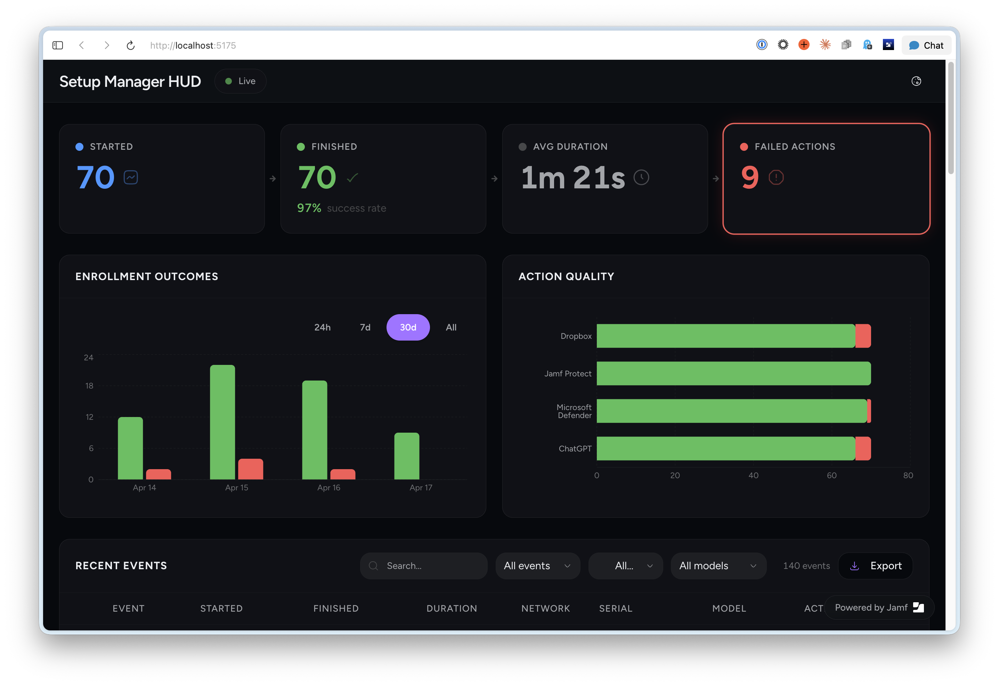
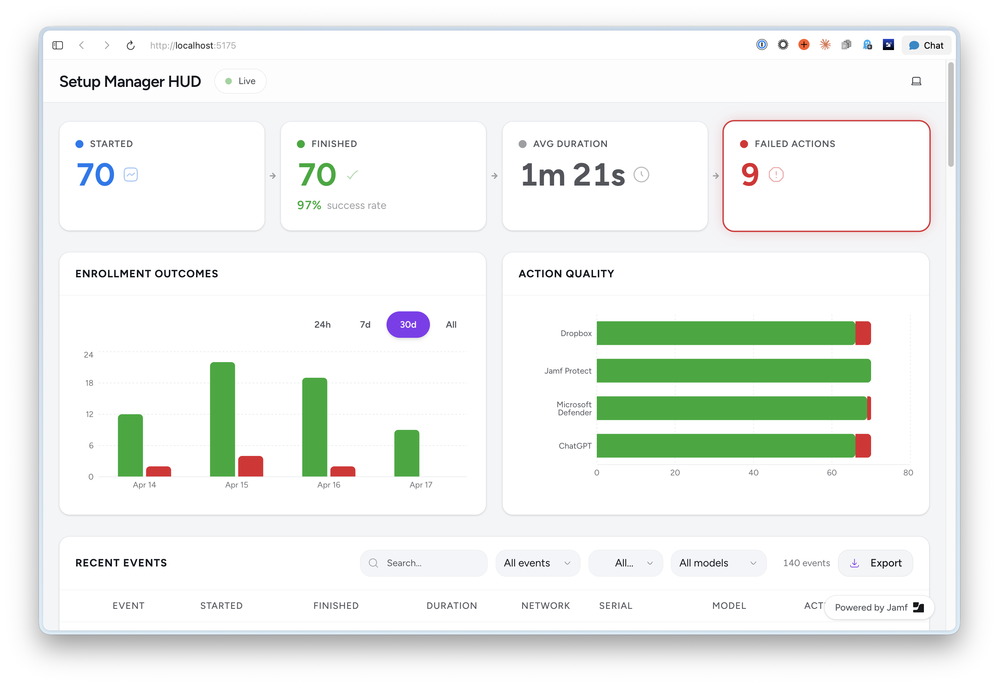

# Setup Manager HUD Docs

These docs are for Mac admins deploying Setup Manager HUD with the Cloudflare
Deploy Button or maintaining a deployed dashboard repository.

| Dark Mode | Light Mode |
|-----------|------------|
|  |  |

| Task | Start here |
|------|------------|
| New deployment | [Getting Started](getting-started.md) |
| Configure storage, secrets, or Worker bindings | [Configuration](configuration.md) |
| Configure Setup Manager, webhook tokens, or dashboard protection | [Security](security.md) |
| Upgrade an existing dashboard | [Upgrading](upgrading.md) |
| Fix webhook, D1, Durable Object, WebSocket, or Access errors | [Troubleshooting](troubleshooting.md) |

For the fastest setup path, start with the main [README](../README.md), then
continue with [Getting Started](getting-started.md).
